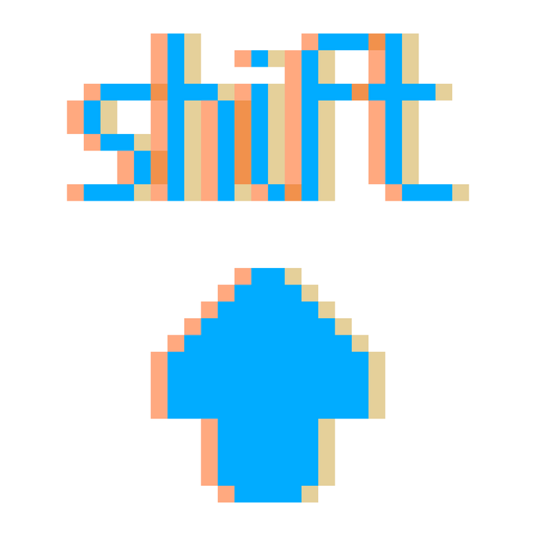
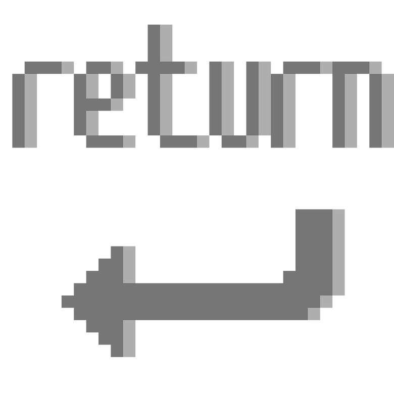

## YouTube

My main channel is [CosmosSurfer](https://www.youtube.com/user/CosmosSurfer), though I rarely use it now.

My very-occasionally-active channel with my cousins is [The FDA](https://www.youtube.com/channel/UCHeY1Kl8McHo4t0XDGarjXw). Of note is our 11-year-long show [The Lake Anna Adventure](https://www.youtube.com/playlist?list=PLFzLTsl90mSeENZSXNPlrUGsAtglbUBq9).

I once had a collab channel with my friend Kadian called [BlueJacketPictures](https://www.youtube.com/user/BlueJacketPictures).

I also once had a Minecraft collab channel with my friends Murray and Brinn called [Murbinfin](https://www.youtube.com/channel/UCLRcrbMLZpdSP6WMuoAfZ_w).

When I was super young I uploaded videos to [Spacetimejig](https://www.youtube.com/user/spacetimejig).

## Podcasts

I uploaded a D&D campaign I ran with my friend Chris called [Galactic Gazette](https://www.youtube.com/channel/UCLuVq-5ipyyXaRrZ-50c2FA) as a video podcast.

My friend Joe and I used to make a podcast about media we enjoy called [Fools and Fiction](https://anchor.fm/foolsandfiction).

## Text-based games

<main class="grid">
  
  
</main>

## Minecraft maps

Way back in the day I made Minecraft maps. Here are some of the ones I published:

[A dungeon-based PVP game](https://www.planetminecraft.com/project/oubliette-minigame/)

[A capture-the-flag PVP game](https://www.planetminecraft.com/project/capture-the-flag-pvp-18/)

[A navigation-based puzzle map](https://www.planetminecraft.com/project/another-one-of-those-non-euclidean-puzzle-maps/)

---

[back](./index.md)
